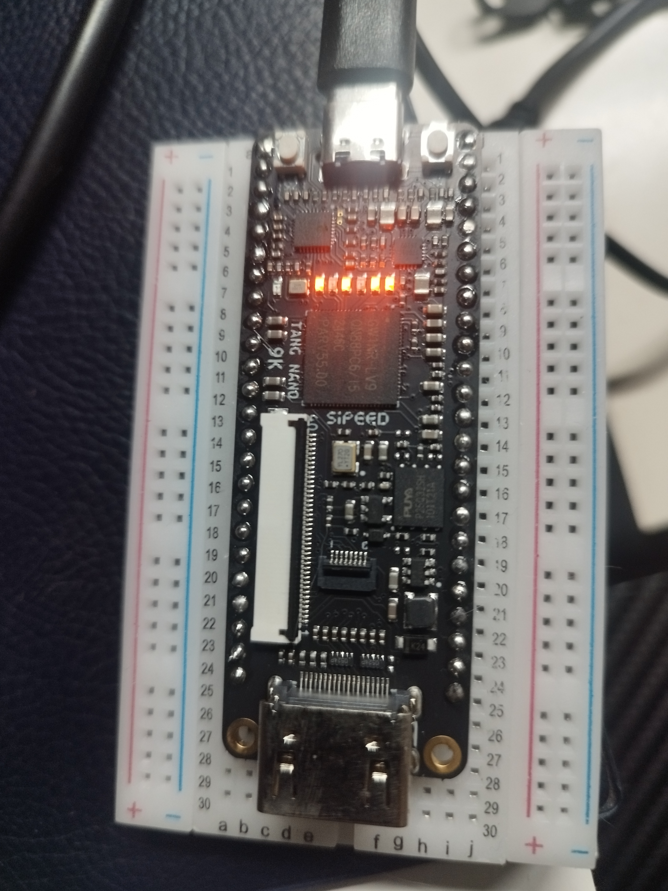
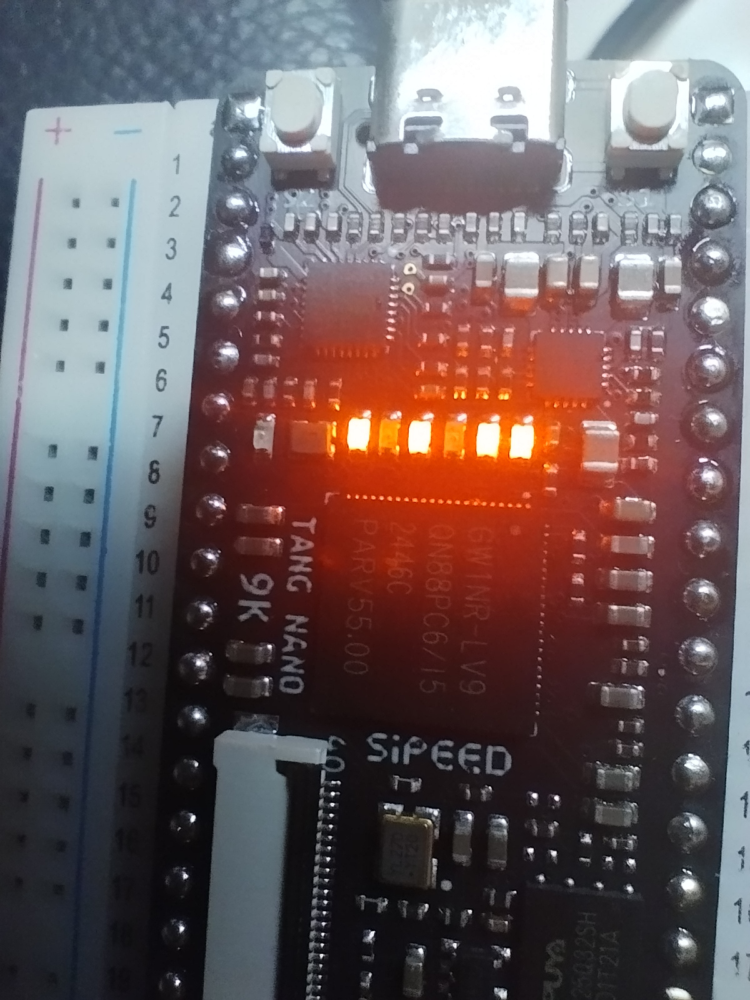

# Prime numbers hardware test

## Prerequisites

Clone the [original project](https://github.com/kritikov/Fully-Parallel-Prime-Number-Search-on-FPGA.git).

Copy the VHD files in the directory of this project.

## Build & load

```bash
make clean
make
make load
```

## Results

### First run





## Disclaimer

The following files were created with the help of OpenAI ChatGPT v5.5:

- tangnano9k.cst
- tangnano9k_top.vhd
- Makefile
